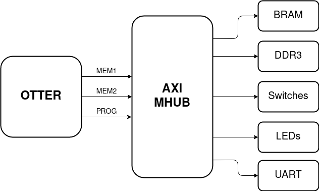

# otter-cpu
The OTTER is a RISC-V processor created by Dr. Callenes for the Cal Poly SLO Computer Engineering Program. This project adds the AXI Memory Hub, a new memory system for the OTTER which uses the AXI interface to connect to memory devices. Two of these devices are the DDR3 memory interface, which gives the OTTER access to 256 MB of DDR3 on the Arty A7, and the MMIO UART Controller, which allows the OTTER to print characters over serial.

This was a Senior Project done by Hayden Rinn and advised by Dr. Callenes at Cal Poly, SLO.



## Project Overview
The original goal of this project was to run Linux on the OTTER. This required several improvements to the processor, including increasing the available memory and implementing several RISC-V extensions required to run Linux. However, the scope of this project was too big to finish in a single Senior Project, so I ended up focusing on memory system instead.

The main feature this project adds is access to the 256 MB of DDR3 memory on the Arty A7 FPGA. Previously, the OTTER only used the FPGA's block memory, which limited the OTTER to about 128 KB of memory. This has been a major limitation on student projects, which often involve software that needs much more memory, sometimes for the instructions alone. Now, using the AXI Memory Hub's DDR3 interface, the OTTER has enough memory to run many programs, including Linux.

The other major feature this project introduces is the ability to print characters over serial. Previously, students only had access to LEDs, a Seven Segment display, and a VGA monitor for output. Now, using the AXI UART-Lite controller connected to the AXI memory hub, characters can be printed over serial in software. To help with this, I have created a serial print function that can send a null terminated string over serial, and I have written a receiver which displays the printed characters on the user's main computer. This has greatly expanded the options for producing output from programs.

## How to Use

This section provides instructions for using the AXI Memory Hub if you have cloned this project. **Even if you have cloned the project, you may have to follow steps 1-9 of [Implementing the AXI Memory Hub](#Implementing-the-AXI-Memory-Hub) to get the project to Synthesize. The MIG 7 Series component in the block design does not transfer properly to Windows.**

### Initializing Memory for Running on the FPGA

To initialize the AXI memory hub's memory, the OTTER Programmer/Debugger is required. I used Trevor McKay's implementation, which is located [here](https://github.com/trmckay/riscv-uart-debugger). In this project, debug mode needs to be enabled for the debugger to communicate with the OTTER. This can be done by pressing BTN0 on the Arty A7. In debug mode, all the RGB LEDs turn yellow and the PC is paused.

### Initializing Memory for Simulation

Since the debugger cannot be used in Simulation, I have written a memory initializer which reads a file and writes each word into the block memory. To use this, uncomment the ```define SIM``` at the top of OTTER_Wrapper.sv. Then, create a `sim.mem` file and add it to your Simulation Sources. Inside this memory file, you can paste newline-separated hexadecimal instructions. These will be loaded into memory at the beginning of the simulation. This process is not instantaneous, and instead finishes when ```mem_init_complete``` is asserted. Keep in mind, since the DDR3 is a hardware device on the Arty A7, it is not available in simulation. Only the block memory can be used.

**Always make sure that ```define SIM``` is uncommented when you are simulating and commented when you are implementing!**

### Printing Characters over Serial
To print characters over serial, the AXI Memory Hub's AXI UART Lite device can be controlled by software. I wrote a serial print function which is located in programs/sprint. This function takes a null terminated string represented as a character pointer as an argument, and sends it over serial.

#### Using sprint in assembly
```assembly
.data
str:	.string "Hello, world!"	# An easy way to create a string

.section .text.init
main:
	la sp, __sp-32	# Initialize the stack pointer (used by sprint)
	la a0, str
	call sprint
```

#### Using sprint in c
```c
extern void sprint(char *);

void main() {
	sprint("Hello from C!");
}
```
Be sure to include init.s if you are compiling a C program in a bare metal environment. Additionally, these examples exist in programs/sprint and can be compiled with `make sdemo` and `make cdemo`.

### Receiving Characters over Serial
To make receiving the printed characters easy, I have implemented a receiver into Trevor McKay's RISC-V Debugger. This version is currently still a pull request as of June of 2021, but may be merged soon. For now, my forked version is available [here](https://github.com/hrinn/riscv-uart-debugger/tree/recv-otter-prints). After the OTTER has been programmed and debug mode has been turned off, all printed strings will appear in the RVDB command line.

## How to Implement

This section provides instructions for implementing components of this project into your own version of the OTTER.

### Implementing the AXI Memory Hub
The AXI memory hub is mainly implemented as a block design, with Verilog modules to translate the input signals.


Follow these steps to setup the AXI memory hub:

1. Add the design/axi_int directory to your project sources.
2. You may have to reconfigure the mig 7 series module. If you open the block design and receive several errors, you will have to. If you can open the block design without errors, you will not have to, and can skip to step 10. This seems to happen on Windows and not Ubuntu.
3. Open the block design.
4. Delete the mig 7 series module and re-add it by clicking the + and searching for "mig." Drag the module to the same spot the old mig was in.
5. Right click on the mig and select Customize Block.
6. Set the following parameters. Leave the rest as their default value.
	- Clock Period: 3,000 ps
	- Memory Part: MT41K128M16XX-15E
	- Memory Voltage: 1.35V
	- Data Width: 16
	- Ordering: Normal
	- AXI Data Width: 32
	- Output Driver Impedance Control: RZQ/6
	- RTT: RZQ/6
	- System Clock: No Buffer
	- Reference Clock: No Buffer
	- Internal Vref: Enabled
	- Pin/Bank Selection Mode: Fixed Pin Out. For assigning the pins, click Read XDC/UCF. Select resources/Arty_C_mig.ucf. Click Validate and then Next.
	- Generate the design.
7. Reconnect the following ports:
	- Connect the DDR3 interface to the DDR3 output port.
	- Connect the init_calib_complete signal to the init_calib_complete output port.
	- Connect ui_clk_sync_rst to the Op1 port of the Utility Vector Logic module (not gate).
	- Connect ui_clk to the M01_ACLK port of the AXI interconnect.
	- Connect S_AXI to the M01_AXI port of the the AXI interconnect.
	- Connect sys_rst to the sys_rst input port.
	- Connect clk_ref_i to the refclk port of the Clocking Wizard.
	- Connect sys_clk_i to the sysclk port of the Clocking Wizard.
	- Connect aresetn to the Res port of the Utility Vector Logic module (not gate).
8. Open the Address Editor (Window > Address Editor). This window maps memory devices to address regions. You will have to reassign an address to the MIG 7 series. You can click the Auto Assign Address button at the top. Whichever address it gives you will be the start address of the DDR3 region of memory.
9. Click Tools > Validate Design. Your design should validate successfully if you followed the steps above correctly. Save your block design.
10. The AXI Memory Hub needs to be instantiated in the Top file of your project. This can be copied directly from this project's design/OTTER_Wrapper.sv. The AXI Memory Hub has many connections. These include the MEM1, MEM2, and PROG interfaces and the DDR3 and MMIO outputs which get mapped to constraints.
11. To convert the OTTER's memory signals (addr, din, dout, memRead, memWrite, etc...) into the AXI4 interfaces (MEM1, MEM2, PROG), I have created translators. These files are the otter_axi_ro_trans.sv and the otter_axi_rw_trans.sv, which convert the otter_ro interface to the axi_ro interface and otter_rw interface to the axi_rw interface respectively. The translator modules are located in design/, and the interfaces are defined in design/memory_interfaces.sv. You can copy how these modules are instantiated and connected from design/OTTER_Wrapper.sv and design/OTTER_CPU.sv.

### Implementing the RISC-V Debugger

Trevor McKay has an additional repository for connecting the debugger to your OTTER [here](https://github.com/trmckay/universal-otter-debugger). 

To implement the OTTER Debugger into your own version of the AXI Memory Hub, further modifications are needed. Both the Debugger and the Serial Controller use the serial ports, and they cannot use them at the same time. To solve this, I have BTN0 on the Arty A7 toggle debug mode. This switches control of the serial ports to the Debugger, which are controlled by the Serial Controller outside of debug mode. To implement this, you can copy the Debug Toggle section of design/OTTER_Wrapper.sv. I also pause the PC when the OTTER is in debug mode, which makes RVDB's debugging features harder to use, but is nice for seeing serial output.

Additionally, you will have to give the Debugger access to the Memory Hub. This is the purpose of the PROG interface. The code below will do these connections, but the code can also be found in design/OTTER_Wrapper.sv.

```verilog
otter_rw cpu_prog();

otter_axi_rw_trans cpu_mem_prog_trans(
	.clk(CLK), .cpu(cpu_prog), .mem(mem_prog) // mem_prog is an output
)

assign cpu_prog.addr = db_mem_addr;
assign cpu_prog.din = db_d_wr;
assign cpu_prog.memRead = db_mem_rd;
assign cpu_prog.memWrite = db_mem_wr;
assign cpu_prog.size = db_mem_size;
assign cpu_prog.sign = 0;
assign db_stall = cpu_prog.stall;
```

## Future Work
I have a few ideas for how the AXI Memory Hub could be improved or further ways the OTTER could be improved using the tools I created.

### Caching
Right now, a major bottleneck of the AXI Memory Hub is that reads and writes take about 5 clock cycles to complete. If the AXI Memory Hub was plugged into a pipelined OTTER, this delay would become even more problematic. This problem could be solved with a cache, but a few changes are required to make a cache work well.

The cache developed in class reads one block from memory each miss. In our implementation, a block was 128 bits. To increase the cache performance, a block could be read in a single memory operation, which would require a 128 bit data width. Unfortunately the AXI4-Lite protocol, which this project uses, only supports 32 bit data widths. Instead of using AXI4-Lite, this project would need to be switched to full AXI4, which supports up to 1024 bits. This would be a bit challenging, but only the block design data widths and AXI-OTTER translators would need to be changed.

### Printing Numbers Over Serial
It would be very handy to have a function which takes an integer as an argument and prints it in character form. To do this, each digit would need to be pulled out of the binary number, and then converted to an ASCII character.

### Receiving Input Over Serial
The AXI UART-Lite device in the memory hub can also receive characters over serial. This could be used to provide input to programs running on the OTTER. A function similar to getchar() could be run on the OTTER to parse this input. The challenge would be processing all of this input before the Rx FIFO fills up, as the FIFO can only hold 16 characters.

Using this idea, someone could write a program that loads a program onto the OTTER using the existing programmer, and then opens a serial 'terminal' which sends user input to the OTTER and displays characters received from the OTTER.

### More AXI MMIO Devices
The main benefit of using the AXI4 interface is that it is compatible with many IP modules provided by Xiliinx. There are some very promising ones, including an AXI Ethernet controller which connects to the Arty A7's ethernet port. If the OTTER had an operating system, device drivers could be written that control the Ethernet port using loads and stores. Then the OTTER could be SSH'd into, which would be a great way to operate the device and would obsolete the debugger and the print receiver.

## Acknowledgements
I would like to thank Dr. Joseph Callenes, who developed the OTTER and advised me during my Senior Project.

I would also like to thank Trevor McKay, who created the RISC-V Debugger and helped me implement it into this project.
